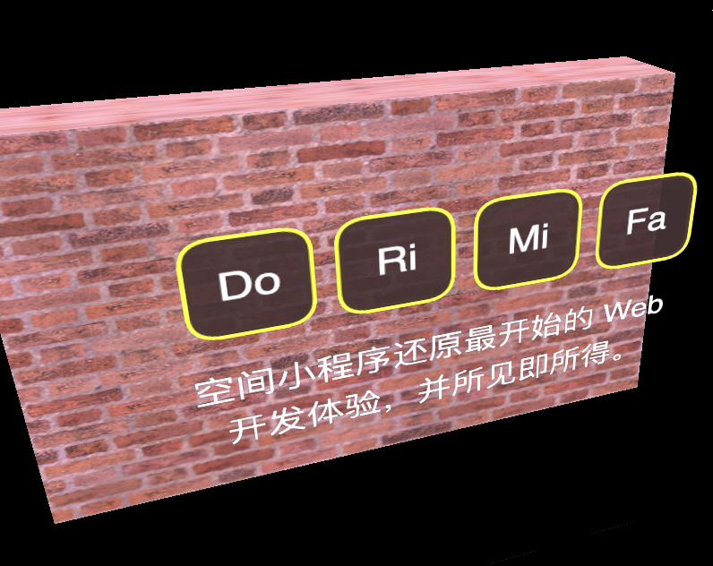

# jsar-gallery-gui-buttons



A JSAR Mini-app demostrates how to use the GUI buttons.

## Open

Type the following URL in JSAR runtime:

```sh
https://raw.githubusercontent.com/M-CreativeLab/jsar-gallery-gui-buttons/main/main.xsml
```

## License

Apache 2.0

